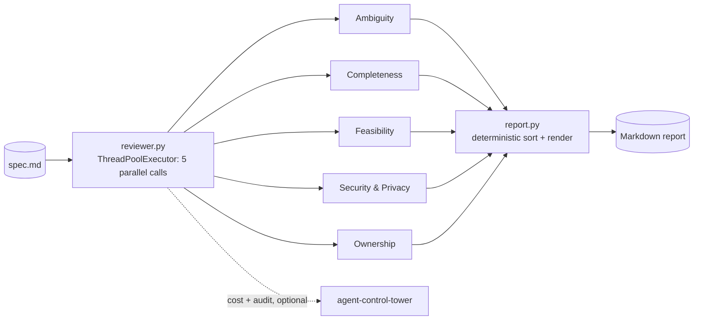

# Spec Review Agent

<div align="center">

[](https://www.python.org/)
[](https://www.anthropic.com/)
[](critics.py)
[](tests/)

</div>

Five independent critic lenses review a spec/PRD before it goes to
engineering — ambiguity, completeness, technical feasibility, security/
privacy, and ownership — each a separate Claude call with a narrow system
prompt, not one call asked to review everything at once.

**Why this exists:** every other agent in this portfolio reads *live
operational data* (Slack, Jira) and summarizes or scores it. This one
reviews a *document a human wrote*, before it ever reaches engineering —
the same rigor code review applies to a diff, applied to a spec instead.
Zero new API setup: it reads a local markdown file, so it's also the
fastest thing in this series to demo live with a real spec on the spot.

## Why five separate calls, not one

A single prompt asked to "review this spec for everything" tends to skim
every category shallowly instead of going deep on any one. Each critic here
gets a narrow, single-purpose system prompt and is explicitly told to
ignore everything outside its lens — the ambiguity critic is told not to
comment on missing sections, the completeness critic is told not to
critique the quality of sections that already exist. Five focused passes,
run in parallel via `ThreadPoolExecutor`, catch more real issues than one
generalist pass over the same document.

## Real output, against a real document

Ran against [`pm-automation-system`](https://github.com/PlainJane20/pm-automation-system)'s
actual `IT_Project_Intake_Form_MVP.md` — both files are in
[`sample_specs/`](sample_specs/) as evidence, not illustration. The Technical
Feasibility lens correctly returned *zero* findings (reported as "clean" in
the summary) rather than inventing something to say — the other four lenses
found real issues: a generic contact placeholder instead of a named owner,
undefined domain-restriction on form access, and personal/budget data
being copied into a more widely-visible Jira project with no redaction
guidance.

## A real bug found building this

The same failure mode caught twice already elsewhere in this portfolio
(`exec-status-rollup`'s judge output, `slack-daily-agent`'s grader): a
forced tool-call schema marking a field `required` does **not** guarantee
the model actually populates it. One critic here — the one with genuinely
nothing to report — omitted the `findings` key from its tool call entirely
instead of returning an empty array, which crashed a `dict["findings"]`
lookup with a `KeyError`. Fixed with `.get("findings", [])` plus a type
check, and it now correctly renders as "clean" instead of crashing. Three
data points is a pattern: **never trust a forced-schema field to be present
just because the schema said it must be** — validate it every time.

## Architecture



## Setup

```bash
python3 -m venv venv
source venv/bin/activate
pip install -r requirements.txt
cp .env.example .env   # or leave blank to reuse ../slack-daily-agent's key
python -m pytest tests/ -v
```

## Usage

```bash
python run_review.py path/to/spec.md
python run_review.py path/to/spec.md --out review.md
python run_review.py path/to/spec.md --daily-budget 1.00   # via agent-control-tower if present
```

## Contact

<div align="center">

### **Navi Sohi**
*Technical Program Manager & Automation Engineer*

<br>

[](https://www.linkedin.com/in/navisohi/)
[](https://github.com/PlainJane20)
[](https://mail.google.com/mail/?view=cm&fs=1&to=nks.ai.dev@gmail.com)

<br>

</div>
