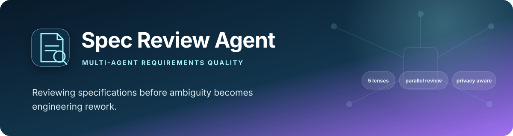
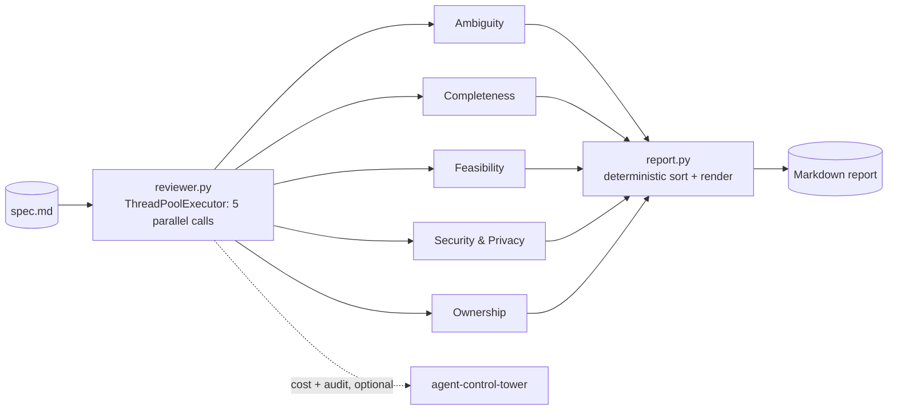

# Spec Review Agent

### *Parallel pre-build review across ambiguity, feasibility, privacy, completeness, and ownership*

<div align="center">

[](https://www.python.org/)
[](https://www.anthropic.com/)
[](critics.py)
[](tests/)
[](https://github.com/PlainJane20/spec-review-agent/actions/workflows/ci.yml)
[](LICENSE)

</div>

Five independent critic lenses review a spec/PRD before it goes to
engineering — ambiguity, completeness, technical feasibility, security/
privacy, and ownership — each a separate Claude call with a narrow system
prompt, not one call asked to review everything at once.

**Why this exists:** every other agent in this portfolio reads *live
operational data* (Slack, Jira) and summarizes or scores it. This one
reviews a *document a human wrote*, before it ever reaches engineering —
the same rigor code review applies to a diff, applied to a spec instead.
Zero new API setup: it reads a local markdown file, so it's also the
fastest thing in this series to demo live with a real spec on the spot.

> **The competency this is really practicing:** running independent,
> narrow-scoped critic agents in parallel and merging their findings
> deterministically, rather than one do-everything prompt. AI code
> review has real, named, funded incumbents (CodeRabbit, Graphite, and
> others); AI *spec/PRD* review specifically as a standalone, multi-lens
> tool didn't turn up an equally obvious set of dedicated competitors in
> a broader market pass — though that's a hunch worth testing further,
> not a dedicated search of this exact niche.

> **Related work in this portfolio:** not a connected pipeline with
> anything else here — this is the only agent in the series reviewing a
> static document instead of live operational data. The real link is a
> shared bug, not a shared pipeline:
> [incident-postmortem-agent](https://github.com/PlainJane20/incident-postmortem-agent)
> hit the exact same "a forced tool-call schema doesn't guarantee the
> model actually populates every required field" failure described below
> — the 4th time it's shown up in this portfolio, after this repo and
> [exec-status-rollup](https://github.com/PlainJane20/exec-status-rollup)
> and [slack-daily-brief](https://github.com/PlainJane20/slack-daily-brief).
> [agent-control-tower](https://github.com/PlainJane20/agent-control-tower)'s
> cost/audit hook in the architecture diagram below is a real, optional
> integration point, not vaporware — but the two agents it's actually
> retrofitted onto live are exec-status-rollup and slack-daily-brief, not
> this one.

## At a glance

| | |
|---|---|
| **Problem** | Ambiguous ownership, missing controls, and infeasible assumptions often reach engineering before they are challenged |
| **Approach** | Five independent, narrow critic passes run in parallel and merge into a deterministic report |
| **Pattern** | Orchestrator-Worker: static parallel fan-out to five critic calls, deterministic merge (see [Architecture pattern](#architecture-pattern)) |
| **Proof** | Reviewed a real intake specification and preserved a clean result when one lens found no issue |
| **Output** | Severity-ranked findings (section, issue, why it matters, suggested fix) with clean-lens reporting |

## Architecture pattern

**Orchestrator-Worker (static fan-out, deterministic merge).** `reviewer.review_spec` (`reviewer.py`) submits the same spec to five hard-coded critic lenses (`critics.py`) on a `ThreadPoolExecutor`, one forced-tool Claude call each. `report.render_report` (`report.py`) then merges and sorts the findings in plain Python.

- **Deterministic vs model-driven:** The fan-out, the output schema check, the severity sort and the report are deterministic. Only the findings inside each lens are model-generated, and there is no model-based orchestrator or synthesis step.
- **Human gate:** None in the tool. It writes a report for a person to read and acts on nothing.
- **Honest limit:** The critics are single-shot calls that never see each other's output, so nothing is cross-checked or reconciled between lenses (for example duplicates or contradictions), and there is no loop or tool use beyond the forced findings schema.

## Competencies demonstrated

| Competency | Observable evidence |
|---|---|
| Requirements quality | Tests ambiguity and completeness before implementation begins |
| Architecture partnership | Surfaces feasibility and interface concerns without pretending to replace architects |
| Security and privacy | Provides a dedicated data/control lens rather than a generic catch-all prompt |
| Ownership design | Converts vague follow-ups into named accountability gaps |
| Multi-agent orchestration | Parallel isolated calls; missing/malformed output is defaulted (`.get` plus a list check), then findings are sorted and rendered deterministically |

## Why five separate calls, not one

A single prompt asked to "review this spec for everything" tends to skim
every category shallowly instead of going deep on any one. Each critic here
gets a narrow, single-purpose system prompt and is explicitly told to
ignore everything outside its lens — the ambiguity critic is told not to
comment on missing sections, the completeness critic is told not to
critique the quality of sections that already exist. Five focused passes
run in parallel via `ThreadPoolExecutor`. The design hypothesis is that
narrow passes go deeper than one generalist pass; **this has not been
measured** (see Known limitations).

## Real output, against a real document

Ran against [`pm-automation-system`](https://github.com/PlainJane20/pm-automation-system)'s
actual `IT_Project_Intake_Form_MVP.md` — both files are in
[`sample_specs/`](sample_specs/) as evidence, not illustration. The Technical
Feasibility lens correctly returned *zero* findings (reported as "clean" in
the summary) rather than inventing something to say — the other four lenses
found real issues: a generic contact placeholder instead of a named owner,
undefined domain-restriction on form access, and personal/budget data
being copied into a more widely-visible Jira project with no redaction
guidance.

## A real bug found building this

The same failure mode caught twice already elsewhere in this portfolio
(`exec-status-rollup`'s judge output, `slack-daily-agent`'s grader): a
forced tool-call schema marking a field `required` does **not** guarantee
the model actually populates it. One critic here — the one with genuinely
nothing to report — omitted the `findings` key from its tool call entirely
instead of returning an empty array, which crashed a `dict["findings"]`
lookup with a `KeyError`. Fixed with `.get("findings", [])` plus a type
check, and it now correctly renders as "clean" instead of crashing. (The
renderer likewise tolerates a severity outside the enum: it is shown as
`unknown` and sorted last, covered by unit tests.) Three
data points is a pattern: **never trust a forced-schema field to be present
just because the schema said it must be** — validate it every time.

## Known limitations

- **No eval of the critics.** The unit tests (`tests/test_report.py`)
  cover only the deterministic report rendering. Nothing measures whether
  the critics find real issues, miss them, or produce false positives.
- **"Five passes beat one" is unmeasured.** There has been no comparison
  against a single generalist pass; the claim is a design hypothesis.
- **One real-document demo.** The only evidence is the single review in
  `sample_specs/` (one spec, one run); it shows the pipeline works, not
  how accurate it is.
- **Findings carry no evidence field.** Each finding has severity,
  section, issue, why it matters, and a suggested fix. There is no quoted
  excerpt, and the `section` reference is model-generated and not checked
  against the spec.
- **Validation is shallow.** Output is a forced tool call; the code
  defaults a missing `findings` key, checks it is a list, and the report
  tolerates unknown severities and missing fields. It does not validate
  finding contents beyond that.
- **Failures can look like "clean".** If a critic returns no tool call,
  its result is an empty findings list, indistinguishable from a lens that
  genuinely found nothing.
- **Not tested offline end to end.** The Claude calls are not mocked in
  tests.

## Architecture


```mermaid
flowchart LR
    Spec[("spec.md")] --> R["reviewer.py<br/>ThreadPoolExecutor: 5 parallel calls"]
    R --> C1["Ambiguity"]
    R --> C2["Completeness"]
    R --> C3["Feasibility"]
    R --> C4["Security & Privacy"]
    R --> C5["Ownership"]
    C1 & C2 & C3 & C4 & C5 --> Report["report.py<br/>deterministic sort + render"]
    Report --> Out[("Markdown report")]
    R -.->|cost + audit, optional| GCT["agent-control-tower"]
```

## Setup

```bash
python3 -m venv venv
source venv/bin/activate
pip install -r requirements.txt
cp .env.example .env   # or leave blank to reuse ../slack-daily-agent's key
python -m pytest tests/ -v
```

## Usage

```bash
python run_review.py path/to/spec.md
python run_review.py path/to/spec.md --out review.md
python run_review.py path/to/spec.md --daily-budget 1.00   # via agent-control-tower if present
```

## License

MIT — see [LICENSE](LICENSE).

## Contact

<div align="center">

### **Navi Sohi**
*Technical Program Manager & Automation Engineer*

<br>

[](https://www.linkedin.com/in/navisohi/)
[](https://github.com/PlainJane20)
[](https://mail.google.com/mail/?view=cm&fs=1&to=nks.ai.dev@gmail.com)

<br>

</div>
